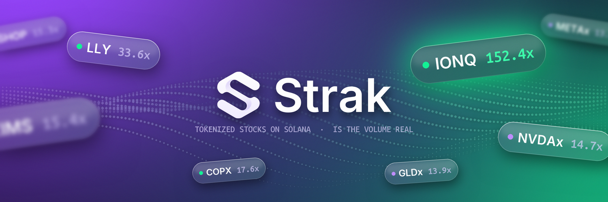

### Everyone shows the price. Strak shows whether it's lying.

Strak is a terminal for every tokenized stock on Solana: xStocks, Ondo and Backpack Securities on one screen, scored by **turnover**, the 24h volume divided by the liquidity behind it.

```
turnover = volume 24h / liquidity
```

| | Turnover | The whole pool changes hands every |
|---|---|---|
| Normal trading | up to 12x | 2 hours or slower |
| Suspiciously hot | 12x to 50x | 29 min to 2 hours |
| Volume is painted | above 50x | faster than 29 min, all day |

Next to the ratio, the last 300 swaps of every hot pool: how many wallets, how much the top three carry, and how many both bought and sold inside the window.

**[Open the terminal](https://strak-six.vercel.app/app)** · [Site](https://strak-six.vercel.app) · [Docs](https://strak-six.vercel.app/docs) · [API](https://strak-six.vercel.app/docs#api)

### Repositories

| | |
|---|---|
| **[strak](https://github.com/usestrak/strak)** | The terminal, the site, the docs and the public API. Hourly history of the whole board. |
| **[turnover](https://github.com/usestrak/turnover)** | The metric on its own: one function, one CLI, zero dependencies. |
| **[strak-sdk](https://github.com/usestrak/strak-sdk)** | Typed client for the public API. Node and browser, zero dependencies. |
| **[awesome-tokenized-stocks](https://github.com/usestrak/awesome-tokenized-stocks)** | Issuers, venues and data sources for tokenized equities. |


<sub>Free, no wallet, no token. Data from Jupiter, DexScreener and GeckoTerminal. Informational only, not financial advice.</sub>
